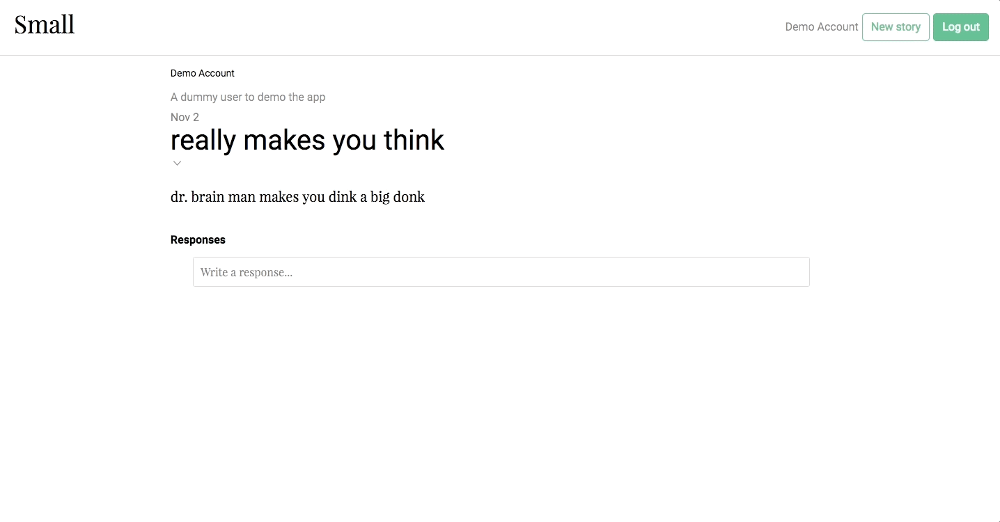

# Small

[Small live](https://sm-all.herokuapp.com/)

Small is a full-stack web app inspired by Medium. It runs Ruby on Rails in the backend with a PostgreSQL database and React.js with Redux architecture in the frontend.

## Features and Implementation

### Articles

Users can publish and edit articles, and read articles from other users.

### Responses

Users can respond to articles from other users, as well as other responses. Through polymorphic component design, responses can be viewed in their own page like an article. Each response displays its parent in a preview pane, which can be used to navigate to the parent.

### User profiles

Each user has a profile that displays all stories by that user, as well as the other users they are following. The same component is used for displaying a user's information on the article page, the user's page, and the user's list of follows.

### Feed

Each user has a personalized homepage that displays articles only by users they are following.

### Single page

No page reloads are required to navigate Small. Components are only updated when necessary.

